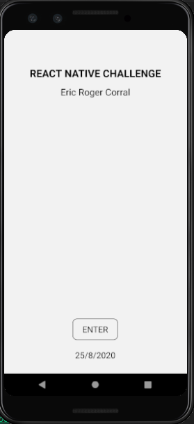
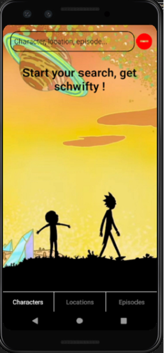
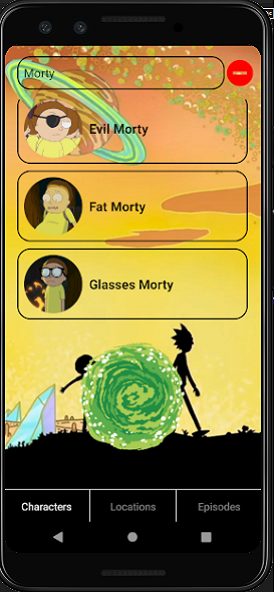
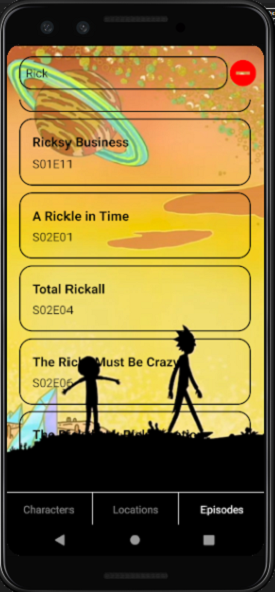
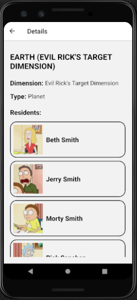
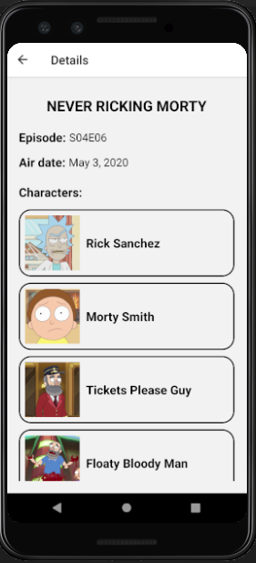
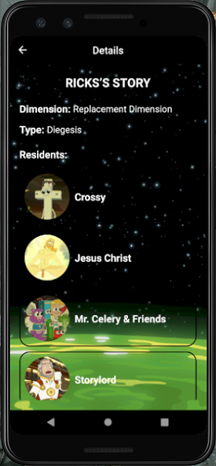

# Challenge Rick and Morty - React Native

## How to use

### Start screen

To start using the app touch the button Get Schwifty!

### Search screen

At the bottom of the screen you can select a filter to search between characters, locations or episodes, after that write the name of what you want to search for open a portal and get, if there are, results of your search. If you touch some result you will get more information of this. In case you want to clear the search just touch the ⛔

### Details screen

Here you will see details about the result you touched before. You can go back touching the 🡠 at the top-left of the screen.

## Get Schwifty !